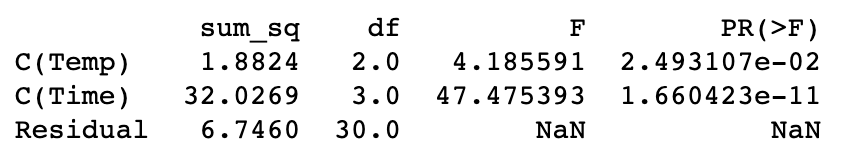

# A/B Testing

While we recommend using Python to find the answers to these questions, it is not required. You are more than welcome to use a calculator or pencil and paper to solve them, too.

???

# Quiz - A/B Testing

?: You design and run an experiment to test if changing the color of a button that will lead users from one page to another on a website leads to a higher click-through rate. You show one version of the website to a random sample of users and another version of the website to a different random sample of users. What kind of hypothesis test do you need to perform? 

( ) one-sample z-test

( ) one-sample t-test

( ) paired two-sample t-test

(X) unpaired two-sample t-test 

?: You’ve been asked to determine if the ratio of sugar to acid content of Satsuma oranges is affected by the storage temperature at which oranges are kept and the number of days the oranges are stored. You obtain data for the sugar-to-acid ratio for oranges kept at temperatures of 4 C, 10 C, or 20 C, and stored for 3, 6, 9, or 12 days. You run an ANOVA test and find

Which features had a significant effect at $\alpha$ = 0.05$ on the sugar-to-acid ratio? 

( ) `Temp`
( ) `Time`
( ) None 
(X) Both `Temp` and `Time` 

?: Question

( ) choice 
( ) choice 
( ) choice 
( ) choice

???

